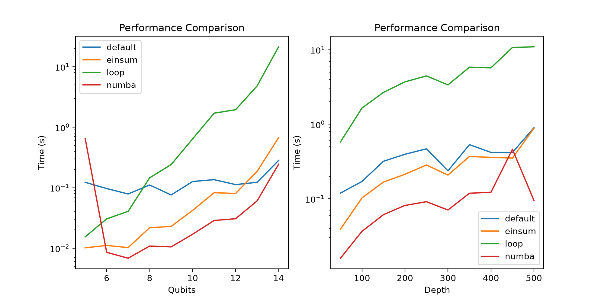

Installation
============

The project requires Python 3.13 or newer. Install it with
`uv <https://docs.astral.sh/uv/>`_ from the repository root:

.. code-block:: console

   uv sync

Run the test suite with:

.. code-block:: console

   uv run pytest

Build the HTML documentation with running the following command in the docs folder:

.. code-block:: console

   uv run .\\make.bat html

As you can see, our simulation performs much better than the Qiskit Aer backend. The screenshot below shows the performance of our simulation compared to the Qiskit Aer backend.

   Screenshot of the documentation.
